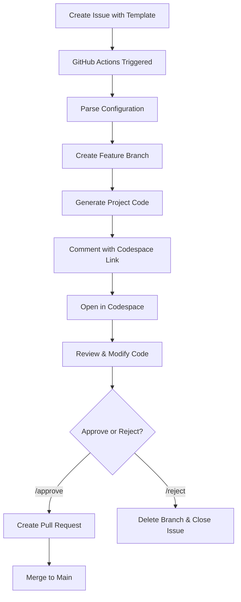

# CodeGen Automator 🤖

Automatically generate Python and Angular projects in GitHub Codespaces with human approval workflow. Also supports creating separate repositories and modifying existing projects.

## 🌟 Features

### Code Generation
- **Template Selection**: Choose from Python (Django/Flask/FastAPI) or Angular project templates via GitHub Issues
- **Automated Code Generation**: Automatically generates complete project scaffolding (40+ files)
- **Intelligent Entity Extraction**: FastAPI generator analyzes project descriptions and creates entity-specific endpoints
- **Komodo UI Integration**: Angular projects include ThermoFisher's Komodo component library
- **Enterprise Architecture**: Module-based patterns with layered structure (API → Service → Repository)
- **Reference Image Support**: Automatically detects and uses UI mockups for Angular generation

### Intelligent Code Generation

The FastAPI generator includes smart entity detection that analyzes your project description and automatically creates context-aware endpoints:

**Example:** Instead of generic "Item" CRUD operations, describe your project:
- *"A blog API with posts, comments, and user management"* → Generates `User`, `Post`, `Comment` endpoints
- *"E-commerce platform with products, orders, and customers"* → Generates `Product`, `Order`, `Customer` endpoints
- *"Task management system with projects and categories"* → Generates `Task`, `Project`, `Category` endpoints

**Supported Entities (20+ types):**
- User, Product, Order, Post, Comment, Task, Project
- Customer, Invoice, Payment, Booking, Event, Category
- Message, Notification, Report, Document, Inventory
- Employee, Department, and more...

Each detected entity gets complete CRUD endpoints with:
- Pydantic models (Base, Create, Update, Response)
- In-memory database with sample data
- RESTful endpoints: GET, POST, PUT, DELETE
- Interactive API documentation at `/docs`

### Repository Management
- **Separate Repository Creation**: Move generated projects to standalone repositories
- **Cross-Repository Modifications**: Add features to existing projects in different repos
- **Automated PR Creation**: Changes create pull requests for review
- **GitHub Codespace Integration**: Opens generated code in a pre-configured Codespace environment
- **Human Approval Workflow**: Review generated code before creating a Pull Request
- **Zero Setup**: No local environment needed - everything runs in the cloud

## 🚀 How It Works



## 📋 Usage

### Step 1: Create an Issue

1. Go to the **Issues** tab in your repository
2. Click **New Issue**
3. Select either:
   - **🐍 Python Project** template
   - **🅰️ Angular Project** template

### Step 2: Fill Out the Template

#### For Python Projects:
- **Project Name**: Enter your project name (e.g., `my-api-service`)
- **Framework**: Choose Django, Flask, or FastAPI
- **Database**: Choose MongoDB, PostgreSQL, SQLite, or MySQL
- **Features**: Select from:
  - User Authentication
  - REST API
  - GraphQL API
  - Celery (Task Queue)
  - Docker Support
  - Unit Tests
- **Description**: Briefly describe your project

#### For Angular Projects:
- **Project Name**: Enter your project name (e.g., `my-dashboard`)
- **Angular Version**: Choose version (17, 16, or 15)
- **Styling**: Choose CSS, SCSS, Tailwind, Angular Material, or Bootstrap
- **Features**: Select from:
  - Routing
  - State Management (NgRx)
  - HTTP Client
  - Forms (Reactive & Template-driven)
  - Authentication Module
  - Unit Tests
  - E2E Tests (Cypress)
  - Docker Support
  - PWA Support
- **Architecture**: Standalone Components or NgModule-based
- **Description**: Briefly describe your project

### Step 3: Wait for Code Generation

Once you submit the issue:
1. ✅ GitHub Actions automatically starts generating your project
2. 🔧 A new branch is created: `codegen/<project-name>-<issue-number>`
3. 📝 Code is generated based on your selections
4. 💬 You'll receive a comment with a Codespace link

### Step 4: Review in Codespace

1. Click the **Launch Codespace** link in the issue comment
2. GitHub Codespace opens with your generated project
3. All dependencies are pre-installed and ready to use
4. Review the generated code
5. Make any necessary modifications
6. Test the application

### Step 5: Approve or Reject

Back in the issue, comment with:

- **`/approve`** - Creates a Pull Request with your generated code
- **`/reject`** - Deletes the branch and closes the issue

### Step 6: Merge the PR

If approved:
1. A Pull Request is automatically created
2. Review the PR and request changes if needed
3. Merge when ready!

---

## 📦 Working with Generated Projects

### Option 1: Create Separate Repository

After generating a project, you can move it to its own standalone repository:

1. Go to **Issues** → **New Issue** → **"📤 Create Separate Repository"**
2. Fill in:
   - **Project Name**: Name from `generated-projects/` folder
   - **Visibility**: Public or Private
   - **Organization**: Optional (leave empty for personal account)
3. Workflow creates new repository and pushes all code
4. Ready for independent development!

**See:** [SEPARATE_REPOS_GUIDE.md](SEPARATE_REPOS_GUIDE.md) for detailed instructions.

### Option 2: Modify Existing Projects

Add features to existing projects in different repositories:

1. Go to **Issues** → **New Issue** → **"🔧 Modify Existing Project"**
2. Fill in:
   - **Target Repository**: `owner/repo-name`
   - **Project Type**: Python or Angular
   - **Modification Type**: feature, enhancement, bugfix
   - **Description**: What to add/change
3. Workflow creates PR in target repository with changes
4. Review and merge!

**Supported Modifications:**
- ✅ Add FastAPI endpoints (route → service → repository)
- ✅ Add Angular components (module → component → service)
- ✅ Update dependencies
- ✅ Add new features

**See:** [SEPARATE_REPOS_GUIDE.md](SEPARATE_REPOS_GUIDE.md) for setup and examples.

---

## 🔧 Setup (One-Time)

### Prerequisites

- GitHub repository with Actions enabled
- Access to GitHub Codespaces

### Installation

1. **Copy the `.github` folder and `scripts` folder** to your repository root

2. **Enable GitHub Actions**:
   - Go to Settings → Actions → General
   - Allow "Read and write permissions"
   - Enable "Allow GitHub Actions to create and approve pull requests"

3. **Enable Issues**:
   - Go to Settings → General → Features
   - Check "Issues"

4. **Optional: Setup PAT for Cross-Repository Operations**:
   - For modifying existing projects in other repos
   - Go to GitHub Settings → Developer settings → Personal access tokens
   - Generate token with `repo` scope
   - Add to repository secrets as `PAT_TOKEN`

5. **Commit and Push**:
   ```bash
   git add .github scripts templates
   git commit -m "Add CodeGen Automator"
   git push
   ```

That's it! The issue templates and workflows are now available.

## 📁 Project Structure

```
.github/
├── ISSUE_TEMPLATE/
│   ├── python-project.yml          # Python project template
│   ├── angular-project.yml         # Angular project template
│   ├── create-repo.yml             # Create separate repository template
│   └── modify-existing.yml         # Modify existing project template
└── workflows/
    ├── codegen-trigger.yml         # Main code generation workflow
    ├── handle-approval.yml         # Approval/rejection workflow
    ├── setup-labels.yml            # Auto-create required labels
    ├── create-separate-repo.yml    # Create standalone repository
    └── modify-existing-project.yml # Modify projects in other repos

scripts/
├── generate-python.py              # Python project generator (1000+ lines)
├── generate-angular.js             # Angular project generator (1000+ lines)
├── parse-modification-request.js   # Parse modification requests
├── modify-python.py                # Apply changes to Python projects
└── modify-angular.js               # Apply changes to Angular projects

templates/
├── fastapi-template.md             # FastAPI enterprise architecture guide
└── angular-template.md             # Angular module-based architecture guide

generated-projects/                  # Generated code stored here
└── <project-name>/                 # Each project in its own folder
```
│       └── handle-approval.yml     # Approval/rejection workflow
├── scripts/
│   ├── generate-project.sh         # Main orchestrator script
│   ├── generate-python.py          # Python project generator
│   └── generate-angular.js         # Angular project generator
└── README.md                       # This file
```

## 🎯 Example Workflows

### Creating a Django REST API

1. Create issue with Python Project template
2. Select:
   - Framework: **Django**
   - Database: **PostgreSQL**
   - Features: **User Authentication**, **REST API**, **Docker Support**, **Unit Tests**
3. Wait for generation
4. Open Codespace, review code
5. Comment `/approve`
6. Merge PR

Generated structure:
```
my-api-service/
├── requirements.txt
├── manage.py
├── README.md
├── Dockerfile
├── docker-compose.yml
└── .gitignore
```

### Creating an Angular Dashboard

1. Create issue with Angular Project template
2. Select:
   - Version: **Angular 17**
   - Styling: **Tailwind CSS**
   - Features: **Routing**, **State Management**, **HTTP Client**, **Forms**
3. Wait for generation
4. Open Codespace, review code
5. Comment `/approve`
6. Merge PR

## 🛠️ Customization

### Adding More Templates

Create new issue templates in `.github/ISSUE_TEMPLATE/`:

```yaml
name: React Project
description: Generate a React app
title: "[REACT] "
labels: ["codegen", "react", "auto-generate"]
# ... rest of the template
```

### Modifying Code Generation

Edit the generator scripts in `scripts/`:
- `generate-python.py` - Customize Python project structure
- `generate-angular.js` - Customize Angular project structure

### Adding New Languages

1. Create new issue template
2. Add label (e.g., `"react"`)
3. Update `generate-project.sh` with new case
4. Create generator script (e.g., `generate-react.js`)

## 📚 Documentation

- **[SEPARATE_REPOS_GUIDE.md](SEPARATE_REPOS_GUIDE.md)** - Moving projects to separate repos and modifying existing projects
- **[ANGULAR_GENERATOR_UPDATE.md](ANGULAR_GENERATOR_UPDATE.md)** - Angular generator with Komodo components
- **[ARCHITECTURE.md](ARCHITECTURE.md)** - Project architecture and design patterns
- **[TESTING.md](TESTING.md)** - Testing strategies and best practices

## 🔐 Security

- Uses GitHub Actions built-in tokens (no manual secrets needed for generation)
- Optional PAT required for cross-repository operations
- All generated code is reviewed before merging
- Branches are automatically deleted on rejection
- Follows least-privilege principle

## 🐛 Troubleshooting

### Issue: Workflow doesn't trigger
- Check that GitHub Actions are enabled
- Verify issue has the correct label (`python`, `angular`, etc.)
- Check Actions tab for errors
- Ensure labels exist (run setup-labels workflow)

### Issue: Codespace won't open
- Verify Codespaces are enabled in your organization
- Check repository visibility settings
- Try opening the branch directly

### Issue: Generation fails
- Check Actions logs for specific errors
- Verify all required fields in issue template are filled
- Ensure project name is valid (lowercase, hyphen-separated)

### Issue: Can't modify existing repository
- Verify PAT is configured with `repo` scope
- Check PAT is added to repository secrets as `PAT_TOKEN`
- Ensure you have access to target repository
- Verify repository name format: `owner/repo`

## 📝 Commands Reference

| Command | Description |
|---------|-------------|
| `/approve` | Create PR with generated code |
| `/reject` | Delete branch and close issue |

## 🎯 Use Cases

### Use Case 1: New Project Generation
Create a complete FastAPI or Angular project from scratch:
- Issue → Generate Code → Review in Codespace → Approve → Merge

### Use Case 2: Separate Repository
Move generated project to its own repo for production:
- Generate Project → Create Separate Repo Issue → New Standalone Repository

### Use Case 3: Modify Existing Project
Add features to existing projects in different repositories:
- Modify Existing Issue → Specify Target Repo → PR Created in Target Repo

## 🤝 Contributing

Contributions welcome! Feel free to:
- Add new project templates
- Improve code generators
- Enhance documentation
- Report bugs

## 📄 License

This project is part of the skills-build-applications-w-copilot-agent-mode repository.

## 🎓 Learn More

- [GitHub Actions Documentation](https://docs.github.com/actions)
- [GitHub Codespaces Documentation](https://docs.github.com/codespaces)
- [Issue Templates Documentation](https://docs.github.com/communities/using-templates-to-encourage-useful-issues-and-pull-requests)

---

**Generated by CodeGen Automator** - Making project scaffolding effortless! 🚀
