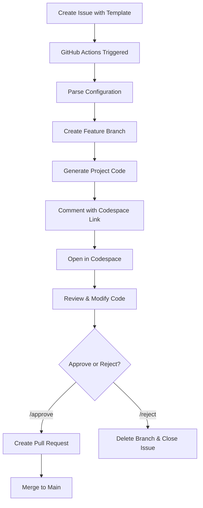

# CodeGen Automator 🤖

Automatically generate Python and Angular projects in GitHub Codespaces with human approval workflow.

## 🌟 Features

- **Template Selection**: Choose from Python (Django/Flask/FastAPI) or Angular project templates via GitHub Issues
- **Automated Code Generation**: Automatically generates project scaffolding based on your selections
- **GitHub Codespace Integration**: Opens generated code in a pre-configured Codespace environment
- **Human Approval Workflow**: Review generated code before creating a Pull Request
- **Zero Setup**: No local environment needed - everything runs in the cloud

## 🚀 How It Works



## 📋 Usage

### Step 1: Create an Issue

1. Go to the **Issues** tab in your repository
2. Click **New Issue**
3. Select either:
   - **🐍 Python Project** template
   - **🅰️ Angular Project** template

### Step 2: Fill Out the Template

#### For Python Projects:
- **Project Name**: Enter your project name (e.g., `my-api-service`)
- **Framework**: Choose Django, Flask, or FastAPI
- **Database**: Choose MongoDB, PostgreSQL, SQLite, or MySQL
- **Features**: Select from:
  - User Authentication
  - REST API
  - GraphQL API
  - Celery (Task Queue)
  - Docker Support
  - Unit Tests
- **Description**: Briefly describe your project

#### For Angular Projects:
- **Project Name**: Enter your project name (e.g., `my-dashboard`)
- **Angular Version**: Choose version (17, 16, or 15)
- **Styling**: Choose CSS, SCSS, Tailwind, Angular Material, or Bootstrap
- **Features**: Select from:
  - Routing
  - State Management (NgRx)
  - HTTP Client
  - Forms (Reactive & Template-driven)
  - Authentication Module
  - Unit Tests
  - E2E Tests (Cypress)
  - Docker Support
  - PWA Support
- **Architecture**: Standalone Components or NgModule-based
- **Description**: Briefly describe your project

### Step 3: Wait for Code Generation

Once you submit the issue:
1. ✅ GitHub Actions automatically starts generating your project
2. 🔧 A new branch is created: `codegen/<project-name>-<issue-number>`
3. 📝 Code is generated based on your selections
4. 💬 You'll receive a comment with a Codespace link

### Step 4: Review in Codespace

1. Click the **Launch Codespace** link in the issue comment
2. GitHub Codespace opens with your generated project
3. All dependencies are pre-installed and ready to use
4. Review the generated code
5. Make any necessary modifications
6. Test the application

### Step 5: Approve or Reject

Back in the issue, comment with:

- **`/approve`** - Creates a Pull Request with your generated code
- **`/reject`** - Deletes the branch and closes the issue

### Step 6: Merge the PR

If approved:
1. A Pull Request is automatically created
2. Review the PR and request changes if needed
3. Merge when ready!

## 🔧 Setup (One-Time)

### Prerequisites

- GitHub repository with Actions enabled
- Access to GitHub Codespaces

### Installation

1. **Copy the `codegen-automator` folder** to your repository root:
   ```
   your-repo/
   ├── codegen-automator/
   │   ├── .github/
   │   │   ├── ISSUE_TEMPLATE/
   │   │   └── workflows/
   │   └── scripts/
   ```

2. **Enable GitHub Actions**:
   - Go to Settings → Actions → General
   - Allow "Read and write permissions"
   - Enable "Allow GitHub Actions to create and approve pull requests"

3. **Enable Issues**:
   - Go to Settings → General → Features
   - Check "Issues"

4. **Commit and Push**:
   ```bash
   git add codegen-automator
   git commit -m "Add CodeGen Automator"
   git push
   ```

That's it! The issue templates and workflows are now available.

## 📁 Project Structure

```
codegen-automator/
├── .github/
│   ├── ISSUE_TEMPLATE/
│   │   ├── config.yml              # Issue template configuration
│   │   ├── python-project.yml      # Python project template
│   │   └── angular-project.yml     # Angular project template
│   └── workflows/
│       ├── codegen-trigger.yml     # Main workflow to generate code
│       └── handle-approval.yml     # Approval/rejection workflow
├── scripts/
│   ├── generate-project.sh         # Main orchestrator script
│   ├── generate-python.py          # Python project generator
│   └── generate-angular.js         # Angular project generator
└── README.md                       # This file
```

## 🎯 Example Workflows

### Creating a Django REST API

1. Create issue with Python Project template
2. Select:
   - Framework: **Django**
   - Database: **PostgreSQL**
   - Features: **User Authentication**, **REST API**, **Docker Support**, **Unit Tests**
3. Wait for generation
4. Open Codespace, review code
5. Comment `/approve`
6. Merge PR

Generated structure:
```
my-api-service/
├── requirements.txt
├── manage.py
├── README.md
├── Dockerfile
├── docker-compose.yml
└── .gitignore
```

### Creating an Angular Dashboard

1. Create issue with Angular Project template
2. Select:
   - Version: **Angular 17**
   - Styling: **Tailwind CSS**
   - Features: **Routing**, **State Management**, **HTTP Client**, **Forms**
3. Wait for generation
4. Open Codespace, review code
5. Comment `/approve`
6. Merge PR

## 🛠️ Customization

### Adding More Templates

Create new issue templates in `.github/ISSUE_TEMPLATE/`:

```yaml
name: React Project
description: Generate a React app
title: "[REACT] "
labels: ["codegen", "react", "auto-generate"]
# ... rest of the template
```

### Modifying Code Generation

Edit the generator scripts in `scripts/`:
- `generate-python.py` - Customize Python project structure
- `generate-angular.js` - Customize Angular project structure

### Adding New Languages

1. Create new issue template
2. Add label (e.g., `"react"`)
3. Update `generate-project.sh` with new case
4. Create generator script (e.g., `generate-react.js`)

## 🔐 Security

- Uses GitHub Actions built-in tokens (no manual secrets needed)
- All generated code is reviewed before merging
- Branches are automatically deleted on rejection
- Follows least-privilege principle

## 🐛 Troubleshooting

### Issue: Workflow doesn't trigger
- Check that GitHub Actions are enabled
- Verify issue has `auto-generate` label
- Check Actions tab for errors

### Issue: Codespace won't open
- Verify Codespaces are enabled in your organization
- Check repository visibility settings
- Try opening the branch directly

### Issue: Generation fails
- Check Actions logs for specific errors
- Verify all required fields in issue template are filled
- Ensure project name is valid (lowercase, hyphen-separated)

## 📝 Commands Reference

| Command | Description |
|---------|-------------|
| `/approve` | Create PR with generated code |
| `/reject` | Delete branch and close issue |

## 🤝 Contributing

Contributions welcome! Feel free to:
- Add new project templates
- Improve code generators
- Enhance documentation
- Report bugs

## 📄 License

This project is part of the skills-build-applications-w-copilot-agent-mode repository.

## 🎓 Learn More

- [GitHub Actions Documentation](https://docs.github.com/actions)
- [GitHub Codespaces Documentation](https://docs.github.com/codespaces)
- [Issue Templates Documentation](https://docs.github.com/communities/using-templates-to-encourage-useful-issues-and-pull-requests)

---

**Generated by CodeGen Automator** - Making project scaffolding effortless! 🚀
